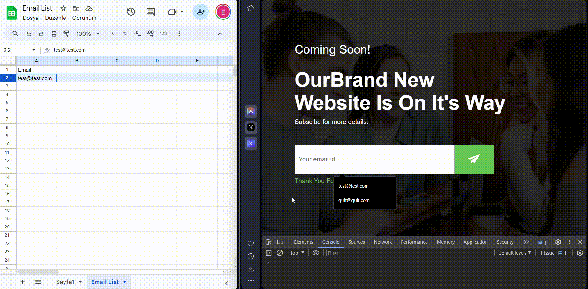

## 🚀 Live Demo
Check out the [Live Demo](https://email-subscription-zeta.vercel.app) to see the subscription form in action.

## 📬 Overview
A simple and customizable email subscription form that stores user emails in a Google Sheets spreadsheet. Deploy this project and start collecting user emails seamlessly.

## 🤝 Contributing
If you would like to contribute to this project, please check the [Contributing Guidelines](CONTRIBUTING.md) for more information.

## 📄 License
This project is licensed under the MIT License.

## 📌 Project Structure
- **`index.html`:** HTML file containing the subscription form and inline JavaScript.
- **`style.css`:** CSS file for styling the subscription form.
- **`google-apps-script.gs`:** Google Apps Script for managing the Google Sheets integration.
- Google Sheet Script codes are [Here](script.gs)

## 📝 Customization
To customize the form for your project:
- Edit the HTML in `index.html` to match your design.
- Update the `scriptURL` in the script tag inside `index.html` with your deployed Google Apps Script URL.

## 📊 Google Sheets Integration
- The form data is stored in a Google Sheets spreadsheet named 'Email List'.
- The Google Apps Script (`google-apps-script.gs`) checks for duplicate entries and returns success or error messages.

## 📬 Contact
If you have any questions or suggestions, feel free to reach out:

- Email: eraycansivri@hotmail.com

Happy Coding! ✨
